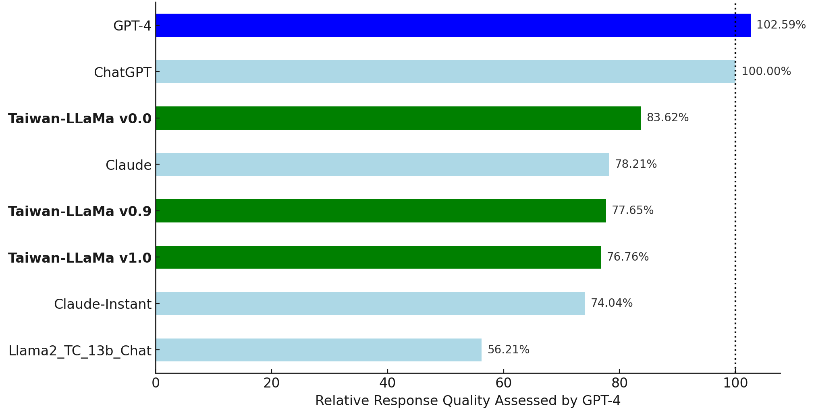

    # Language Models for Taiwanese Culture

<p align="center">
✍️ <a href="https://huggingface.co/spaces/yentinglin/Taiwan-LLaMa2" target="_blank">Online Demo</a>  
•
🤗 <a href="https://huggingface.co/yentinglin" target="_blank">HF Repo</a> • 🐦 <a href="https://twitter.com/yentinglin56" target="_blank">Twitter</a> • 📃 <a href="https://arxiv.org/pdf/2305.13711.pdf" target="_blank">[Paper Coming Soon]</a>  
• 👨️ <a href="https://yentingl.com/" target="_blank">Yen-Ting Lin</a>  
</p>

[](https://github.com/tatsu-lab/stanford_alpaca/blob/main/LICENSE)
[](https://github.com/tatsu-lab/stanford_alpaca/blob/main/DATA_LICENSE)


## Overview
Taiwan-LLaMa is a full parameter fine-tuned model based on LLaMa 2 for traditional chinese applications.

## Demo
A live demonstration of the model can be accessed at [Hugging Face Spaces](https://huggingface.co/spaces/yentinglin/Taiwan-LLaMa2).

## Taiwanese Culture Examples

| Question                            | ChatGPT                                                                                                                                                                                                                                                                                                                           | **Taiwan LLaMa v1.0**                                                                                                                                                                                                                                                                                                                                      |
|:---------------------------------------|:-------------------------------------------------------------------------------------------------------------------------------------------------------------------------------------------------------------------------------------------------------------------------------------------------------------------------------------|:-------------------------------------------------------------------------------------------------------------------------------------------------------------------------------------------------------------------------------------------------------------------------------------------------------------------------------------|
| 以惡地景觀著名的是高雄哪一個景點?   | 以惡地地景著名的是高雄市的旗津。  ❌                                                                                                                                                                                                                                                                    | 高雄以擁有惡地景觀著名的景點是田寮月世界。⭕                                                                                             |
| 唐鳳是誰？                          | 唐鳳（Audrey Tang）是台灣的政治家、社會活動家和軟體工程師。她於2016年擔任台灣行政院數位政務委員，是台灣政府歷史上首位沒有政黨背景的政務官。唐鳳在軟體工程領域有豐富的經驗。 | 唐鳳是政治評論家、資訊社會學研究者，也是台灣第一位擔任政府數位政委的人。 |
| NTU 在哪?                           | NTU位於新加坡，具體地址是50 Nanyang Avenue, Singapore 639798。                                                                                                                                                                                                                                                            | NTU 是國立臺灣大學的縮寫。它是臺灣的一所頂尖研究型大學，位於臺北市。|
| 甚麼是22K? | "22K" 可能指的是金的純度，尤其是在珠寶和金飾方面。 | "22K"是指台灣的大學畢業生的起薪，大約是新台幣22,000元。這個詞被用來形容大學畢業生的起薪偏低，並且在就業市場上對於大學畢業生的需求不足。|
| 肉圓要不要加香菜？                  | 這是個個人口味的問題，有些人喜歡在肉圓中加入香菜，因為香菜的清香可以增添風味；而有些人則不喜歡香菜的味道，覺得它會蓋過其他食材的味道。所以要不要加香菜，可以根據個人喜好來決定。 | 這是一個個人喜好的問題，有些人喜歡在肉圓裡加香菜，有些人不喜歡。在台灣，肉圓加香菜是一種常見的做法，這是一種在肉圓上加香菜的做法。然而，在其他國這是一個文化差異的問題。                                                                                                                                                         |


## Model

We provide a number of model checkpoints that we trained. Please find them on Hugging Face [here](https://huggingface.co/models?search=taiwan-llama). Here are some quick links to the checkpoints that are finetuned from LLaMa 2:

| **Model**                                              | **13B**                                                                                                                       | 
|--------------------------------------------------------|-------------------------------------------------------------------------------------------------------------------------------|
| **Taiwan-LLaMa v1.0**                                  | 🤗 <a href="https://huggingface.co/yentinglin/Taiwan-LLaMa-v1.0" target="_blank">yentinglin/Taiwan-LLaMa-v1.0</a>  | 
| Taiwan-LLaMa v0.9 (partial instruction set)            | 🤗 <a href="https://huggingface.co/yentinglin/Taiwan-LLaMa-v0.9" target="_blank">yentinglin/Taiwan-LLaMa-v0.9</a>  | 
| Taiwan-LLaMa v0.0 (no Traditional Chinese pretraining) | 🤗 <a href="https://huggingface.co/yentinglin/Taiwan-LLaMa-v0.0" target="_blank">yentinglin/Taiwan-LLaMa-v0.0</a>  | 

## Data

Here are some quick links to the datasets that we used to train the models:

| **Dataset**                     | **Link**                                                                                                                      | 
|---------------------------------|-------------------------------------------------------------------------------------------------------------------------------|
| **Instruction-tuning**      | 🤗 <a href="https://huggingface.co/datasets/yentinglin/traditional_chinese_instructions" target="_blank">yentinglin/traditional_chinese_instructions</a>                                           | 
| Traditional Chinese Pretraining | 🤗 <a href="https://huggingface.co/datasets/yentinglin/zh_TW_c4" target="_blank">yentinglin/zh_TW_c4</a>                                   | 


## Generic Capabilities on Vicuna Benchmark 

The data is translated into traditional Chinese for evaluating the general capability.




The scores are calculated with ChatGPT as the baseline, represented as 100%. The other values show the relative performance of different models compared to ChatGPT.

| Language Model                      | Relative Score (%) |
|-------------------------------------|--------------------|
| GPT-4                               | 102.59%            |
| ChatGPT                             | 100.00%            |
| **Taiwan-LLaMa v0.0**               | 83.62%             |
| Claude-2.0                          | 78.21%             |
| **Taiwan-LLaMa v0.9**               | 77.65%             |
| **Taiwan-LLaMa v1.0**               | 76.76%             |
| Claude-Instant-1.2                  | 74.04%             |
| Llama2_Traditional_Chinese_13b_Chat | 56.21%             |


## How to deploy model on my own machine?
We recommend hosting models with [🤗 Text Generation Inference](https://github.com/huggingface/text-generation-inference). Please see their [license](https://github.com/huggingface/text-generation-inference/blob/main/LICENSE) for details on usage and limitations.
```bash
bash run_text_generation_inference.sh "yentinglin/Taiwan-LLaMa" NUM_GPUS DIR_TO_SAVE_MODEL PORT MAX_INPUT_LEN MODEL_MAX_LEN
```

## Setup development environment
```bash
conda create -n taiwan-llama python=3.10 -y 
conda activate taiwan-llama
pip install -r requirements.txt
```


## Citation
If you use our code, data, or models in your research, please cite this repository. You can use the following BibTeX entry:

```bibtex
@misc{taiwanllama,
    author={Yen-Ting Lin},
    title={Taiwanese-Aligned Language Models based on Meta-Llama2},
    year={2023},
    url={https://github.com/adamlin120/Taiwan-LLaMa},
    note={Code and models available at https://github.com/adamlin120/Taiwan-LLaMa},
}
```

## License
The code in this project is licensed under the Apache 2.0 License - see the [LICENSE](LICENSE) file for details.

The models included in this project are licensed under the LLAMA 2 Community License. See the [LLAMA2 License](https://github.com/facebookresearch/llama/blob/main/LICENSE) for full details.

## OpenAI Data Acknowledgment
The data included in this project were generated using OpenAI's models and are subject to OpenAI's Terms of Use. Please review [OpenAI's Terms of Use](https://openai.com/policies/terms-of-use) for details on usage and limitations.


## Acknowledgements

We thank [Meta LLaMA team](https://github.com/facebookresearch/llama) and [Vicuna team](https://github.com/lm-sys/FastChat) for their open-source efforts in democratizing large language models.
